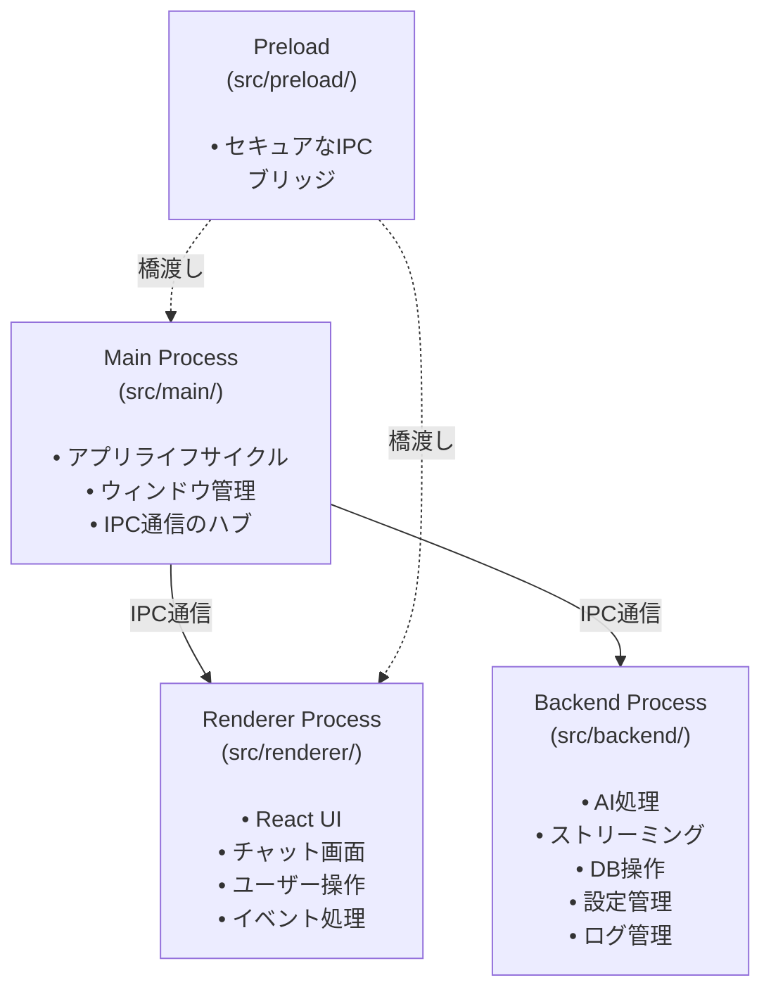
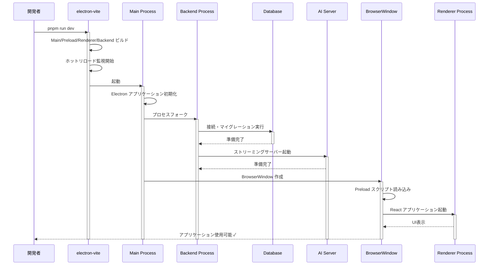
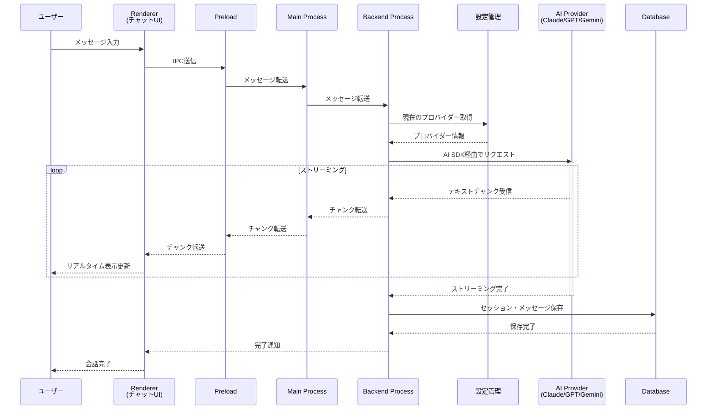
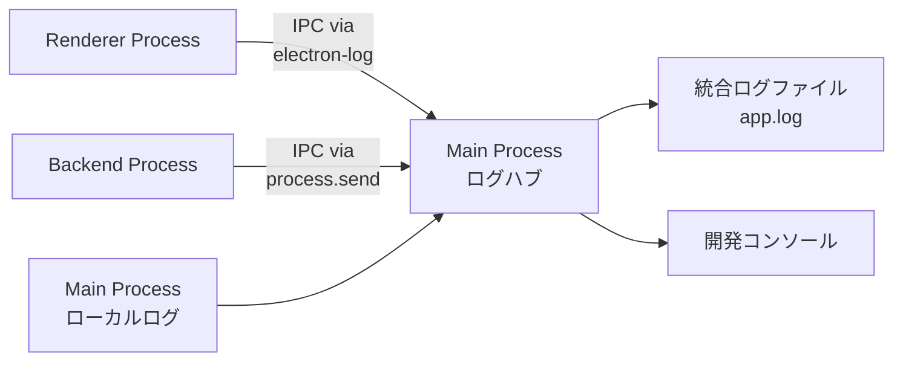

# 開発者向けプロジェクト概要

このドキュメントは、プロジェクトに初めて参加する開発者向けに、技術スタックと主要な処理フローをまとめたものです。

## 目次

- [環境構築・セットアップ](#環境構築セットアップ)
- [技術スタック](#技術スタック)
- [アーキテクチャ](#アーキテクチャ)
- [起動フロー](#起動フロー)
- [AI チャットの処理フロー](#ai-チャットの処理フロー)
- [主な開発コマンド](#主な開発コマンド)
- [パスエイリアス](#パスエイリアス)
- [デバッグ方法](#デバッグ方法)

## 環境構築・セットアップ

### 必要な環境

- **Node.js**: v18 以上推奨（v20 推奨）
- **pnpm**: v9 以上
  ```bash
  npm install -g pnpm
  ```

### 初回セットアップ手順

1. **リポジトリのクローン**

   ```bash
   git clone <repository-url>
   cd electron-ai-starter
   ```

2. **依存関係のインストール**

   ```bash
   pnpm install
   ```

   `postinstall` スクリプトが自動的に `electron-builder install-app-deps` を実行します。

3. **環境変数の設定（任意）**

   AI プロバイダーの API キーは、アプリケーション起動後に設定画面から設定できます。
   事前に設定したい場合は、アプリケーション内のデータベース（`./tmp/db/app.db`）に保存されます。

4. **開発サーバーの起動**

   ```bash
   pnpm run dev
   ```

   初回起動時、以下が自動的に実行されます：
   - データベースの作成（`./tmp/db/app.db`）
   - マイグレーションの実行
   - 開発用ログディレクトリの作成（`./tmp/logs/`）

5. **動作確認**

   アプリケーションが起動したら、以下を確認：
   - ウィンドウが正常に表示される
   - 設定画面で AI プロバイダーの API キーを設定
   - チャット機能が動作する

### プロジェクトのディレクトリ構造（初回ビルド後）

```
electron-ai-starter/
├── src/                  # ソースコード
├── out/                  # ビルド成果物（自動生成）
├── tmp/                  # 開発用一時ファイル（自動生成）
│   ├── db/               # 開発用データベース
│   └── logs/             # 開発用ログファイル
├── resources/            # ビルドリソース
│   └── db/migrations/    # データベースマイグレーション
├── docs/                 # ドキュメント
└── ...
```

### トラブルシューティング（セットアップ時）

#### pnpm install が失敗する

```bash
# pnpm のキャッシュをクリア
pnpm store prune

# node_modules を削除して再インストール
rm -rf node_modules
pnpm install
```

#### データベースエラーが出る

```bash
# 開発用データベースをリセット
pnpm run db:reset

# アプリを再起動
pnpm run dev
```

#### ビルドエラーが出る

```bash
# 型チェックを実行して詳細を確認
pnpm run typecheck

# out ディレクトリを削除して再ビルド
rm -rf out
pnpm run build
```

## 技術スタック

### コア技術

- **Electron 37**: デスクトップアプリケーションフレームワーク
- **React 19 + TypeScript**: UIレンダリング
- **Tailwind CSS 4**: スタイリング
- **electron-vite**: ビルド・開発サーバー

### データベース

- **SQLite** (better-sqlite3): 軽量なローカルデータベース
- **Drizzle ORM**: 型安全なクエリ構築とマイグレーション管理

### AI統合

- **AI SDK**: ストリーミング対応のAI統合ライブラリ
- **Assistant UI**: チャットインターフェースコンポーネント
- **対応プロバイダー**:
  - Anthropic (Claude)
  - OpenAI (GPT)
  - Google (Gemini)

### UIコンポーネント

- **Shadcn/ui**: カスタマイズ可能なコンポーネントライブラリ (New York スタイル)
- **Radix UI**: アクセシブルなUIプリミティブ
- **Lucide React**: アイコンライブラリ

## アーキテクチャ

このプロジェクトは標準的なElectronの2プロセスモデルを拡張した **3プロセス構成** を採用しています。



### 各プロセスの詳細

#### Main Process (`src/main/`)

Electronアプリケーションのエントリーポイント。

- **責務**:
  - アプリケーションの起動・終了
  - BrowserWindow の作成と管理
  - Backend Process のフォーク
  - IPC通信の中継

- **主要ファイル**:
  - `index.ts` - メインエントリーポイント
  - `server.ts` - バックエンドプロセスの起動管理

#### Backend Process (`src/backend/`)

ビジネスロジックを担当する独立したNode.jsプロセス。

- **責務**:
  - AI プロバイダーの管理と呼び出し
  - ストリーミングレスポンスの処理
  - データベース操作
  - アプリケーション設定の管理
  - ログ記録

- **ディレクトリ構成**:
  ```
  backend/
  ├── ai/              # AI関連
  │   ├── factory.ts   # プロバイダーファクトリー
  │   └── streaming.ts # ストリーミング処理
  ├── db/              # データベース
  │   ├── index.ts     # DB接続
  │   └── schema.ts    # スキーマ定義
  ├── settings/        # 設定管理
  ├── paths/           # パス設定
  ├── logger.ts        # ロガー設定
  └── server.ts        # サーバーエントリーポイント
  ```

#### Renderer Process (`src/renderer/`)

ユーザーインターフェースを担当するReactアプリケーション。

- **責務**:
  - UIのレンダリング
  - ユーザーインタラクションの処理
  - チャット画面の表示
  - IPC経由でのバックエンド通信

- **ディレクトリ構成**:
  ```
  renderer/src/
  ├── components/          # Reactコンポーネント
  │   ├── ui/              # Shadcn/ui コンポーネント
  │   └── assistant-ui/    # AIチャットコンポーネント
  ├── lib/                 # ユーティリティ
  └── assets/              # グローバルCSS
  ```

#### Preload (`src/preload/`)

セキュアなIPC通信を実現するブリッジスクリプト。

- **責務**:
  - Renderer と Main/Backend 間の安全な通信
  - コンテキスト分離の維持
  - APIの公開

## 起動フロー

開発時の起動シーケンス:



## AI チャットの処理フロー

ユーザーがメッセージを送信してからレスポンスを受け取るまでの流れ:



## 主な開発コマンド

### 開発・ビルド

```bash
pnpm run dev          # 開発サーバー起動（ホットリロード有効）
pnpm run build        # プロダクションビルド（型チェック含む）
pnpm run start        # ビルド済みアプリの実行
```

### コード品質

```bash
pnpm run lint         # ESLint実行
pnpm run format       # Prettier実行
pnpm run typecheck    # TypeScript型チェック（全体）
pnpm run typecheck:node  # Node.js環境の型チェック
pnpm run typecheck:web   # Web環境の型チェック
```

### テスト

```bash
pnpm run test:backend # バックエンドプロセスのテスト実行
```

### データベース

```bash
pnpm run drizzle-kit  # Drizzle Kit CLI（generate, migrate, push, studio）
pnpm run db:reset     # 開発用DBのリセット
```

### ビルド・配布

```bash
pnpm run build:win    # Windows実行ファイル作成
pnpm run build:mac    # macOS実行ファイル作成
pnpm run build:linux  # Linux実行ファイル作成
pnpm run build:unpack # パッケージングなしビルド
```

## パスエイリアス

プロジェクト全体で使用できるパスエイリアス（`electron.vite.config.ts` で定義）:

```typescript
@renderer  → src/renderer/src
@backend   → src/backend
@main      → src/main
@common    → src/common
@resources → resources
```

**使用例**:

```typescript
// 相対パスの代わりに
import { logger } from '@backend/logger'
import { SomeType } from '@common/types'
import { Button } from '@renderer/components/ui/button'
```

## ログ設定

このプロジェクトは **統合ログシステム** を採用しており、3つのプロセス（Main、Backend、Renderer）のログが1つのファイルに集約されます。

### 統合ログアーキテクチャ



### ログファイルの場所

**統合ログファイル**: `app.log`

- **開発環境**: `./tmp/logs/app.log`
- **本番環境**: Electron の userData ディレクトリ `/logs/app.log`
  - Windows: `C:\Users\<username>\AppData\Roaming\electron-ai-starter\logs\app.log`
  - macOS: `~/Library/Logs/electron-ai-starter/app.log`
  - Linux: `~/.config/electron-ai-starter/logs/app.log`

### ログフォーマット

統合ログは以下の形式で出力されます：

```
[2025-11-08 10:23:45.123] [info] [main] Main window created
[2025-11-08 10:23:46.456] [info] [backend] Database initialized
[2025-11-08 10:23:47.789] [debug] [backend:ai] AI request started { provider: 'anthropic' }
[2025-11-08 10:23:48.012] [info] [renderer] User clicked send button
```

フォーマット: `[日時] [レベル] [スコープ] メッセージ`

- **日時**: ミリ秒精度のタイムスタンプ
- **レベル**: error, warn, info, debug
- **スコープ**: プロセスとモジュールを識別（例: `backend:ai`, `renderer`）
- **メッセージ**: ログメッセージと構造化データ

### 各プロセスでのログ使用方法

#### Main Process

```typescript
import logger from './logger'

logger.info('Main window created')
logger.error('Failed to create window', { error: err })
```

#### Backend Process

```typescript
import logger from './logger'

logger.info('Database initialized')
logger.debug('Query executed', { query, result })

// サブスコープを作成
const aiLogger = logger.child('ai')
aiLogger.info('AI request started', { provider: 'anthropic' })
```

#### Renderer Process

```typescript
import { logger } from '@/lib/logger'

logger.info('User clicked send button')
logger.warn('API response slow', { duration: 5000 })
```

### 機能

- **統合ログ**: 全プロセスのログが時系列で1ファイルに集約
- **ファイルローテーション**: 5MB でローテーション
- **構造化ログ**: データをオブジェクトで渡せる
- **スコープ管理**: プロセス・モジュール単位でログを識別
- **開発時の詳細ログ**: debug レベルまで記録
- **本番時の最適化**: info レベル以上のみ記録

### ログの確認方法

**開発中にリアルタイムで確認**:

```bash
# Linux/macOS
tail -f ./tmp/logs/app.log

# Windows (PowerShell)
Get-Content ./tmp/logs/app.log -Wait -Tail 50
```

**特定のプロセスのログだけフィルタ**:

```bash
# Backend のログのみ表示
grep '\[backend\]' ./tmp/logs/app.log

# エラーログのみ表示
grep '\[error\]' ./tmp/logs/app.log
```

## データベース設定

- **開発環境**: `./tmp/db/app.db`
- **本番環境**: Electron の userData ディレクトリ `/db/app.db`
- **マイグレーション**: `resources/db/migrations/`（ビルドに含まれる）
- **スキーマ**: 設定用のkey-valueストレージテーブル

## デバッグ方法

### 各プロセスのデバッグ

Electronアプリケーションは複数のプロセスで動作するため、それぞれに適したデバッグ方法があります。

#### Renderer Process（React UI）のデバッグ

Renderer Process は通常のWebアプリケーションと同様にデバッグできます。

**Chrome DevTools を使用**:

1. 開発サーバーを起動
   ```bash
   pnpm run dev
   ```

2. アプリケーション内で DevTools を開く
   - **Windows/Linux**: `Ctrl + Shift + I`
   - **macOS**: `Cmd + Option + I`

3. デバッグ機能
   - **Console**: `console.log()` の出力確認
   - **Elements**: DOM の検査とスタイル確認
   - **Network**: （現在は使用していない）
   - **Sources**: ブレークポイントを設定してデバッグ
   - **React DevTools**: React コンポーネントの状態確認（拡張機能が必要）

**よく使うコンソールデバッグ**:

```typescript
// Renderer Process内で
console.log('UI State:', someState)
console.error('エラー:', error)
console.table(arrayData) // 配列やオブジェクトを表形式で表示
```

#### Main Process のデバッグ

Main Process は Node.js 環境で動作するため、VSCode のデバッガーやログで確認します。

**ログを使用する方法（最も簡単）**:

```typescript
// src/main/index.ts など
import logger from './logger'

logger.info('アプリ起動')
logger.debug('Window options', { width: 900, height: 670 })
```

ログは統合ログファイル `app.log` に出力されます：
- **開発環境**: `./tmp/logs/app.log`
- **コンソール**: ターミナルにも出力（開発時のみ）

**VSCode デバッガーを使用する方法**:

`.vscode/launch.json` を作成：

```json
{
  "version": "0.2.0",
  "configurations": [
    {
      "name": "Debug Main Process",
      "type": "node",
      "request": "launch",
      "cwd": "${workspaceFolder}",
      "runtimeExecutable": "${workspaceFolder}/node_modules/.bin/electron-vite",
      "runtimeArgs": ["dev", "--inspect"],
      "console": "integratedTerminal"
    }
  ]
}
```

VSCode の「実行とデバッグ」から起動してブレークポイントを設定できます。

#### Backend Process のデバッグ

Backend Process は独立した Node.js プロセスで、ログは IPC 経由で Main Process に送信され、統合ログファイルに記録されます。

**logger を使用**:

```typescript
// src/backend/ 内のファイルで
import logger from './logger'

logger.info('AI リクエスト開始', { provider: 'anthropic' })
logger.error('エラーが発生', { error: err })
logger.debug('デバッグ情報', { data })

// サブスコープを作成してモジュール別にログを管理
const aiLogger = logger.child('ai')
aiLogger.info('ストリーミング開始', { model: 'claude-3' })
```

ログの出力先：
- **統合ログファイル**: `./tmp/logs/app.log`（Main Process 経由で記録）
- **コンソール**: 開発時は直接コンソールにも出力

### ログの確認方法

#### 統合ログの確認（推奨）

全プロセスのログが時系列で1つのファイルに集約されているので、処理フローを追いやすくなっています：

```bash
# 統合ログをリアルタイム表示
tail -f ./tmp/logs/app.log

# Windows (PowerShell)
Get-Content ./tmp/logs/app.log -Wait -Tail 50
```

#### プロセス別にフィルタして確認

特定のプロセスのログだけ見たい場合：

```bash
# Backend のログのみ表示
grep '\[backend\]' ./tmp/logs/app.log

# Backend の AI モジュールのログのみ
grep '\[backend:ai\]' ./tmp/logs/app.log

# エラーログのみ表示
grep '\[error\]' ./tmp/logs/app.log

# Main と Backend のログのみ
grep -E '\[(main|backend)\]' ./tmp/logs/app.log
```

#### 本番環境でのログ確認

本番ビルドの場合、統合ログは Electron の userData ディレクトリに保存されます：

- **Windows**: `C:\Users\<username>\AppData\Roaming\electron-ai-starter\logs\app.log`
- **macOS**: `~/Library/Logs/electron-ai-starter/app.log`
- **Linux**: `~/.config/electron-ai-starter/logs/app.log`

### よくあるデバッグシナリオ

#### IPC 通信のデバッグ

IPC 通信が正常に動作しているか確認する方法：

**Renderer → Main の通信**:

```typescript
// Renderer 側
console.log('[Renderer] IPC 送信:', message)
await window.api.someMethod(message)

// Main 側（または Backend 側）
import logger from './logger'
logger.info('[Main] IPC 受信', { message })
```

#### AI ストリーミングのデバッグ

ストリーミングが正常に動作しているか確認：

```typescript
// Backend Process (src/backend/server.ts など)
logger.info('[AI] ストリーミング開始', { provider, model })

// ストリーミング中
logger.debug('[AI] チャンク受信', { chunk: text })

// 完了時
logger.info('[AI] ストリーミング完了', { totalChunks })
```

#### データベースクエリのデバッグ

データベース操作をデバッグ：

```typescript
import { db } from './db'
import logger from './logger'

const result = await db.select().from(settings).where(...)
logger.debug('[DB] クエリ結果', { result })
```

### パフォーマンスのデバッグ

実行時間を計測する場合：

```typescript
// 開始
console.time('AI Response Time')

// AI 処理...

// 終了
console.timeEnd('AI Response Time') // "AI Response Time: 1234.5ms" と表示
```

### トラブルシューティング

#### DevTools が開かない

Renderer Process で DevTools が開かない場合：

```typescript
// src/main/index.ts
function createWindow() {
  const mainWindow = new BrowserWindow({
    // ...
    webPreferences: {
      devTools: true, // 明示的に有効化
      // ...
    }
  })

  // 強制的に開く
  mainWindow.webContents.openDevTools()
}
```

#### ホットリロードが効かない

```bash
# electron-vite のキャッシュをクリア
rm -rf out/
pnpm run dev
```

#### ログが出力されない

```typescript
// ログレベルを確認
import logger from './logger'
logger.transports.file.level = 'debug' // すべてのログを出力
logger.transports.console.level = 'debug'
```

## 次のステップ

- 詳細なコーディング規約は `CLAUDE.md` を参照
- UI コンポーネントの追加方法: `pnpm run shadcn add [component-name]`
- 困ったときは各ディレクトリの README や型定義を確認

---

**更新日**: 2025-11-08
