# Releio - 要件定義概要

## ドキュメント情報

- **作成日**: 2025-11-18
- **バージョン**: 1.0
- **ステータス**: 初版
- **プロジェクト**: Releio - AI統合デスクトップアプリケーション

## 1. プロジェクト概要

Releioは、複数のAIプロバイダーと統合し、Model Context Protocol (MCP)を通じて外部ツールにアクセス可能なElectronベースのデスクトップアプリケーションです。ユーザーは複数のAIモデルを切り替えながら会話を行い、ファイルシステムやAPIなどの外部リソースにアクセスできます。

### 1.1 主要機能

- **マルチAIプロバイダー対応**: OpenAI、Anthropic、Google、Azure OpenAIに対応
- **MCP統合**: 外部ツール（ファイルシステム、GitHub、データベース等）への接続
- **チャットセッション管理**: 会話の保存、再開、履歴管理
- **ネットワーク設定**: プロキシ・証明書のサポート（企業環境対応）
- **自動更新**: アプリケーションの自動更新機能
- **データベース管理**: SQLiteベースのローカルデータ管理

### 1.2 アーキテクチャ

本アプリケーションは、Electronの標準的な2プロセスモデルを拡張した**3プロセス構成**を採用しています：

- **Main Process**: アプリライフサイクル、ウィンドウ管理
- **Backend Process**: AI処理、MCP管理、データベース操作（Utility Process）
- **Renderer Process**: React UIによるユーザーインターフェース

## 2. ユースケース図

以下のPlantUMLダイアグラムは、Releioの全体的なユースケース（合計33個）を示しています。

```plantuml
@startuml
left to right direction
skinparam actorStyle awesome

actor "ユーザー" as User
actor "AIプロバイダー" as AIProvider
actor "MCPサーバー" as MCPServer

rectangle "Releio システム" {
  package "AIプロバイダー管理" {
    usecase "UC-01: AIプロバイダー設定を追加する" as UC01
    usecase "UC-02: AIプロバイダー設定を編集する" as UC02
    usecase "UC-03: AIプロバイダー設定を削除する" as UC03
    usecase "UC-04: モデルリストを更新する" as UC04
    usecase "UC-05: カスタムモデルを追加する" as UC05
  }

  package "AI会話" {
    package "初期化・検証" {
      usecase "UC-06A: チャット使用前の検証" as UC06A
      usecase "UC-06B: モデル選択の永続化" as UC06B
    }

    package "メッセージ送信" {
      usecase "UC-07: メッセージを送信する" as UC07
      usecase "UC-07A: 送信前の自動圧縮" as UC07A
      usecase "UC-07B: メッセージの永続化" as UC07B
    }

    package "応答受信" {
      usecase "UC-08: ストリーミング応答を受信する" as UC08
      usecase "UC-08A: セッション履歴の復元" as UC08A
      usecase "UC-08B: ストリーミングの中断" as UC08B
      usecase "UC-08C: 圧縮マーカーの表示" as UC08C
    }

    package "ツール呼び出し" {
      usecase "UC-09: ツール呼び出しを確認する" as UC09
    }

    package "エラーハンドリング" {
      usecase "UC-09A: エラー時のメッセージ復元" as UC09A
      usecase "UC-09B: エラー診断と詳細表示" as UC09B
      usecase "UC-09C: メッセージ再送信" as UC09C
    }
  }

  package "チャットセッション管理" {
    usecase "UC-10: 新しいセッションを作成する" as UC10
    usecase "UC-11: 過去のセッションを表示する" as UC11
    usecase "UC-12: セッションを削除する" as UC12
    usecase "UC-13: セッション履歴を圧縮する" as UC13
  }

  package "MCPサーバー管理" {
    usecase "UC-14: MCPサーバーを追加する" as UC14
    usecase "UC-15: MCPサーバーを有効化/無効化する" as UC15
    usecase "UC-16: MCPツール一覧を表示する" as UC16
    usecase "UC-17: MCPリソース一覧を表示する" as UC17
  }

  package "ネットワーク設定" {
    usecase "UC-18: プロキシ設定を行う" as UC18
    usecase "UC-19: 証明書を設定する" as UC19
    usecase "UC-20: 接続テストを実行する" as UC20
  }

  package "アプリケーション管理" {
    usecase "UC-21: 更新を確認する" as UC21
    usecase "UC-22: 更新をインストールする" as UC22
    usecase "UC-23: データベースをリセットする" as UC23
  }
}

User --> UC01
User --> UC02
User --> UC03
User --> UC04
User --> UC05
User --> UC06A
User --> UC06B
User --> UC07
User --> UC07A
User --> UC07B
User --> UC08
User --> UC08A
User --> UC08B
User --> UC08C
User --> UC09
User --> UC09A
User --> UC09B
User --> UC09C
User --> UC10
User --> UC11
User --> UC12
User --> UC13
User --> UC14
User --> UC15
User --> UC16
User --> UC17
User --> UC18
User --> UC19
User --> UC20
User --> UC21
User --> UC22
User --> UC23

UC04 --> AIProvider : API呼び出し
UC06A --> AIProvider : 設定検証
UC07 --> AIProvider : メッセージ送信
UC07A --> AIProvider : トークン数確認
UC08 --> AIProvider : ストリーミング受信
UC08A --> AIProvider : 履歴読み込み
UC09 --> MCPServer : ツール実行
UC14 --> MCPServer : 接続確立
UC16 --> MCPServer : ツール取得
UC17 --> MCPServer : リソース取得
UC20 --> AIProvider : テスト接続

@enduml
```

## 3. ユースケース一覧

| ID | ユースケース名 | 主要アクター | 説明 |
|----|-------------|------------|------|
| UC-01 | AIプロバイダー設定を追加する | ユーザー | 新しいAIプロバイダー（OpenAI、Anthropic等）の接続設定を追加する |
| UC-02 | AIプロバイダー設定を編集する | ユーザー | 既存のプロバイダー設定（APIキー、エンドポイント等）を変更する |
| UC-03 | AIプロバイダー設定を削除する | ユーザー | 不要になったプロバイダー設定を削除する |
| UC-04 | モデルリストを更新する | ユーザー | プロバイダーAPIから最新のモデル一覧を取得する |
| UC-05 | カスタムモデルを追加する | ユーザー | API経由で取得できないカスタムモデルを手動で追加する |
| UC-06A | チャット使用前の検証 | ユーザー | プロバイダー設定とモデルの存在を確認し、チャット使用可能性を検証する |
| UC-06B | モデル選択の永続化 | システム | ユーザーが選択したモデルをlocalStorageに保存し、次回起動時に復元する |
| UC-07 | メッセージを送信する | ユーザー | AIに対してメッセージを送信する |
| UC-07A | 送信前の自動圧縮 | システム | メッセージ送信前にトークン制限をチェックし、必要に応じて会話履歴を自動圧縮する |
| UC-07B | メッセージの永続化 | システム | ユーザーメッセージとAI応答をデータベースに保存する |
| UC-08 | ストリーミング応答を受信する | ユーザー | AIからのストリーミング形式の応答をリアルタイムで受信する |
| UC-08A | セッション履歴の復元 | システム | 過去のチャットセッションのメッセージ履歴を読み込み、画面に表示する |
| UC-08B | ストリーミングの中断 | ユーザー | AI応答のストリーミング中に生成を中断する |
| UC-08C | 圧縮マーカーの表示 | システム | 会話履歴が圧縮された箇所にマーカーを表示し、要約内容を確認できるようにする |
| UC-09 | ツール呼び出しを確認する | ユーザー | AIがMCPツールを実行する際の詳細情報を確認する |
| UC-09A | エラー時のメッセージ復元 | システム | メッセージ送信が失敗した場合、失敗したメッセージを入力フィールドに自動復元する |
| UC-09B | エラー診断と詳細表示 | ユーザー | エラーの種類を分類し、詳細情報と推奨対処法を表示する |
| UC-09C | メッセージ再送信 | ユーザー | 失敗したメッセージを編集または修正して再送信する |
| UC-10 | 新しいセッションを作成する | ユーザー | 新しいチャット会話セッションを開始する |
| UC-11 | 過去のセッションを表示する | ユーザー | 保存された過去のチャットセッションを一覧表示・選択する |
| UC-12 | セッションを削除する | ユーザー | 不要なチャットセッションを削除する |
| UC-13 | セッション履歴を圧縮する | ユーザー | 長い会話履歴をトークン制限内に収めるため圧縮する |
| UC-14 | MCPサーバーを追加する | ユーザー | 新しいMCPサーバー（ファイルシステム、GitHub等）を追加する |
| UC-15 | MCPサーバーを有効化/無効化する | ユーザー | MCPサーバーの起動状態を切り替える |
| UC-16 | MCPツール一覧を表示する | ユーザー | 接続されたMCPサーバーが提供するツール一覧を表示する |
| UC-17 | MCPリソース一覧を表示する | ユーザー | 接続されたMCPサーバーが提供するリソース一覧を表示する |
| UC-18 | プロキシ設定を行う | ユーザー | 企業ネットワーク環境でのプロキシサーバー設定を行う |
| UC-19 | 証明書を設定する | ユーザー | カスタムCA証明書や証明書検証設定を行う |
| UC-20 | 接続テストを実行する | ユーザー | 設定したネットワーク構成でAIプロバイダーへの接続をテストする |
| UC-21 | 更新を確認する | ユーザー | アプリケーションの新しいバージョンが利用可能か確認する |
| UC-22 | 更新をインストールする | ユーザー | 新しいバージョンをダウンロード・インストールする |
| UC-23 | データベースをリセットする | ユーザー | 開発環境でデータベースを初期状態にリセットする |

## 4. システム境界とアクター

### 4.1 主要アクター

| アクター | 説明 |
|---------|------|
| ユーザー | アプリケーションを使用してAIと対話する人 |
| AIプロバイダー | OpenAI、Anthropic、Google、Azure等の外部AIサービス |
| MCPサーバー | Model Context Protocolで外部ツール・リソースを提供するサーバー |

### 4.2 システム境界

- **内部**: Releioアプリケーション（Main/Backend/Rendererプロセス）
- **外部**: AIプロバイダーAPI、MCPサーバー、OSのプロキシ・証明書設定

## 5. 非機能要件の概要

### 5.1 パフォーマンス要件

- The システム shall ストリーミング応答を100ms以内にユーザーに表示を開始する
- The システム shall 複数のMCPサーバーを同時に管理し、個別サーバーの障害が全体に影響しない

### 5.2 セキュリティ要件

- The システム shall APIキーと環境変数を暗号化せずuserDataディレクトリに保存する（OSのファイルパーミッションで保護）
- The システム shall MCPサーバーはユーザーが明示的に追加したもののみ実行する

### 5.3 互換性要件

- The システム shall Windows、macOS、Linuxの各プラットフォームで動作する
- The システム shall V1設定からV2設定へ自動マイグレーションを行う

### 5.4 ユーザビリティ要件

- The システム shall 設定変更を即座にUIに反映する
- The システム shall エラー発生時に詳細なメッセージをログファイルに記録する

## 6. 詳細要件ドキュメントへの参照

個々のユースケースの詳細な要件記述（EARSフォーマット）は、以下のドキュメントを参照してください：

- [UC-01 〜 UC-05: AIプロバイダー管理要件](./REQUIREMENTS_AI_PROVIDER.md)
- [UC-06 〜 UC-09: AI会話要件](./REQUIREMENTS_AI_CHAT.md)
- [UC-10 〜 UC-13: チャットセッション管理要件](./REQUIREMENTS_SESSION.md)
- [UC-14 〜 UC-17: MCPサーバー管理要件](./REQUIREMENTS_MCP.md)
- [UC-18 〜 UC-20: ネットワーク設定要件](./REQUIREMENTS_NETWORK.md)
- [UC-21 〜 UC-23: アプリケーション管理要件](./REQUIREMENTS_APP_MGMT.md)

## 7. 設計文書への参照

実装設計の詳細は、`docs/`配下の以下の文書を参照してください：

- [MCP統合設計](./MCP_INTEGRATION_DESIGN.md)
- [AI設定V2設計](./AI_SETTINGS_V2_DESIGN.md)
- [チャットセッション永続化](./CHAT_SESSION_PERSISTENCE.md)
- [プロキシ・証明書設計](./PROXY_AND_CERTIFICATE_DESIGN.md)
- [自動更新](./AUTO_UPDATE.md)
- [会話履歴圧縮設計](./CONVERSATION_HISTORY_COMPRESSION_DESIGN.md)

## 8. 用語集

| 用語 | 説明 |
|------|------|
| MCP | Model Context Protocol - AIと外部データソースを接続するオープンスタンダード |
| EARS | Easy Approach to Requirements Syntax - 要件記述のための構造化フォーマット |
| Provider Config | 特定のAIプロバイダーへの接続設定（APIキー、エンドポイント等） |
| Model Selection | チャット時に選択する「プロバイダー設定 + モデルID」の組み合わせ |
| Streaming | AIの応答を完全に生成する前に、生成中のテキストをリアルタイムで受信する方式 |
| Tool Call | AIがMCPツールを実行すること（ファイル読み取り、API呼び出し等） |
| Session | 一連のチャットメッセージと応答のまとまり |
| Utility Process | Electronのバックエンド処理専用プロセス（Main Processのブロッキングを回避） |

---

**次のステップ**: 各機能領域の詳細要件ドキュメントを参照し、EARSフォーマットで記述された具体的な受け入れ基準を確認してください。
