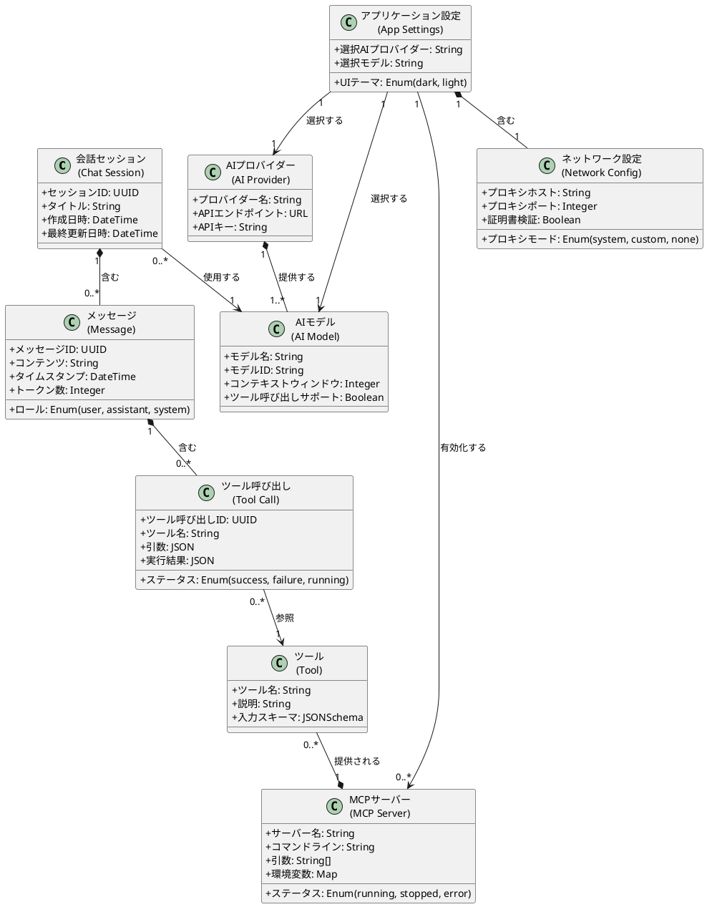

# ドメインモデル（Domain Model）

> システムの外界を表現し、ビジネスエンティティやそれらの関係を含むモデル。

本文書は、Electron AI Starter Templateプロジェクトにおけるドメインモデルを記述したものです。このモデルは、システムが扱う主要な概念とそれらの関係を明確化し、要求の理解を深めるための基礎となります。

---

## 1. ドメインの概要

本システムは、**AIチャットアプリケーション**のドメインに属します。主要な概念は以下の通りです：

- **会話（Conversation）**: ユーザーとAIプロバイダー間の一連のメッセージ交換
- **メッセージ（Message）**: 会話を構成する個々の発言（ユーザーまたはAI）
- **AIプロバイダー（AI Provider）**: 会話のレスポンスを生成する外部サービス
- **ツール（Tool）**: AIが会話中に使用できる外部機能
- **設定（Configuration）**: システムの動作を制御するパラメータ

---

## 2. 主要なドメインエンティティ

### 2.1 会話セッション（Chat Session）

**概念**: ユーザーとAI間の独立した会話の単位。

**属性**:
- セッションID（一意識別子）
- タイトル
- 作成日時
- 最終更新日時
- 使用AIプロバイダー
- 使用モデル

**関連**:
- 1つの会話セッションは、複数のメッセージを含む
- 1つの会話セッションは、1人のユーザーに属する

---

### 2.2 メッセージ（Message）

**概念**: 会話セッション内の個々の発言。

**属性**:
- メッセージID（一意識別子）
- ロール（user、assistant、system）
- コンテンツ（テキスト本文）
- タイムスタンプ
- トークン数
- ツール呼び出し情報（オプション）
  - ツール名
  - 引数
  - 実行結果
  - 実行ステータス

**関連**:
- 1つのメッセージは、1つの会話セッションに属する
- 1つのメッセージは、0個以上のツール呼び出しを含む

---

### 2.3 AIプロバイダー（AI Provider）

**概念**: AIレスポンスを生成する外部サービス。

**属性**:
- プロバイダー名（OpenAI、Anthropic、Google）
- APIエンドポイント
- 認証情報（APIキー）
- 利用可能なモデルリスト

**サブタイプ**:
- **OpenAI Provider**: GPTモデルを提供
- **Anthropic Provider**: Claudeモデルを提供
- **Google Provider**: Geminiモデルを提供

**関連**:
- 1つのAIプロバイダーは、複数のモデルを提供する
- 1つの会話セッションは、1つのAIプロバイダーを使用する

---

### 2.4 AIモデル（AI Model）

**概念**: AIプロバイダーが提供する特定のモデル。

**属性**:
- モデル名（例：gpt-4、claude-3-opus、gemini-pro）
- モデルID
- コンテキストウィンドウサイズ（最大トークン数）
- 機能（ツール呼び出しサポート、ビジョンサポートなど）

**関連**:
- 1つのAIモデルは、1つのAIプロバイダーに属する
- 1つの会話セッションは、1つのAIモデルを使用する

---

### 2.5 MCPサーバー（MCP Server）

**概念**: Model Context Protocolを実装し、AIが使用できるツールを提供する外部プロセス。

**属性**:
- サーバー名
- コマンドライン（実行ファイルパス）
- 引数リスト
- 環境変数
- ステータス（実行中、停止中、エラー）
- 標準エラー出力（診断情報）

**関連**:
- 1つのMCPサーバーは、複数のツールを提供する
- 複数のMCPサーバーが同時に実行可能

---

### 2.6 ツール（Tool）

**概念**: AIが会話中に呼び出すことができる外部機能。

**属性**:
- ツール名
- 説明
- 入力スキーマ（引数の型定義）
- 所属MCPサーバー

**関連**:
- 1つのツールは、1つのMCPサーバーによって提供される
- 1つのメッセージは、0個以上のツール呼び出しを含む

---

### 2.7 ツール呼び出し（Tool Call）

**概念**: メッセージ内でAIが特定のツールを実行した記録。

**属性**:
- ツール呼び出しID
- ツール名
- 引数（JSON）
- 実行結果（JSON）
- 実行ステータス（成功、失敗、実行中）
- エラーメッセージ（失敗時）

**関連**:
- 1つのツール呼び出しは、1つのメッセージに属する
- 1つのツール呼び出しは、1つのツールを参照する

---

### 2.8 ネットワーク設定（Network Configuration）

**概念**: システムの外部通信を制御する設定。

**属性**:
- プロキシモード（System、Custom、None）
- プロキシホスト
- プロキシポート
- プロキシ認証情報（ユーザー名、パスワード）
- カスタムCA証明書リスト
- 証明書検証フラグ

**関連**:
- 1つのシステムは、1つのネットワーク設定を持つ
- ネットワーク設定は、全てのAI API通信に適用される

---

### 2.9 アプリケーション設定（Application Settings）

**概念**: システムの全体的な動作を制御するパラメータ。

**属性**:
- 選択されたAIプロバイダー
- 選択されたモデル
- 有効なMCPサーバーリスト
- ネットワーク設定
- UIテーマ（ダーク、ライト）
- ログレベル

**関連**:
- 1つのシステムは、1つのアプリケーション設定を持つ

---

## 3. ドメインモデル図

---

## 4. ドメインルール（ビジネスルール）

### 4.1 会話セッションのルール
1. **一意性**: 各会話セッションは一意のIDを持つ
2. **時系列性**: メッセージは作成日時順に並べられる
3. **完全性**: 会話セッションが削除されると、含まれる全てのメッセージも削除される

### 4.2 メッセージのルール
1. **ロール制約**: メッセージのロールは、user、assistant、systemのいずれかである
2. **順序性**: 通常、userメッセージの後にassistantメッセージが続く
3. **トークン制限**: 会話セッション全体のトークン数が、選択されたモデルのコンテキストウィンドウを超える場合、圧縮が必要

### 4.3 ツール呼び出しのルール
1. **実行順序**: 複数のツール呼び出しは、AIが指定した順序で実行される
2. **依存性**: あるツール呼び出しが失敗した場合でも、他のツール呼び出しは実行される
3. **マルチステップ**: AIは、ツール呼び出し結果を受け取った後、さらにツール呼び出しを要求できる

### 4.4 MCPサーバーのルール
1. **独立性**: 各MCPサーバーは独立したプロセスとして実行される
2. **可用性**: MCPサーバーが停止またはエラー状態の場合、そのツールは使用できない
3. **並行性**: 複数のMCPサーバーが同時に実行可能

### 4.5 ネットワーク設定のルール
1. **プラットフォーム制約**: Systemモードは現在Windowsでのみ完全にサポートされる
2. **優先順位**: Customモードの設定は、Systemモードより優先される
3. **適用範囲**: ネットワーク設定は、全てのAI API通信およびMCPサーバー通信に適用される

---

## 5. ドメイン用語集

| 用語 | 説明 |
|------|------|
| **会話セッション** | ユーザーとAI間の独立した会話の単位 |
| **メッセージ** | 会話セッション内の個々の発言 |
| **ロール** | メッセージの送信者タイプ（user、assistant、system） |
| **トークン** | AIモデルが処理するテキストの最小単位 |
| **コンテキストウィンドウ** | AIモデルが一度に処理できる最大トークン数 |
| **ストリーミング** | AIレスポンスをリアルタイムで段階的に受信する方式 |
| **MCP (Model Context Protocol)** | AIと外部ツールを連携させるための標準プロトコル |
| **ツール呼び出し** | AIが会話中に外部機能を実行すること |
| **プロキシ** | ネットワーク通信を仲介するサーバー |
| **CA証明書** | HTTPSサーバーの信頼性を検証するための証明書 |

---

## 変更履歴

| 日付 | バージョン | 変更内容 |
|------|-----------|---------|
| 2025-11-25 | 1.0 | 初版作成（反復1、方向づけフェーズ） |
